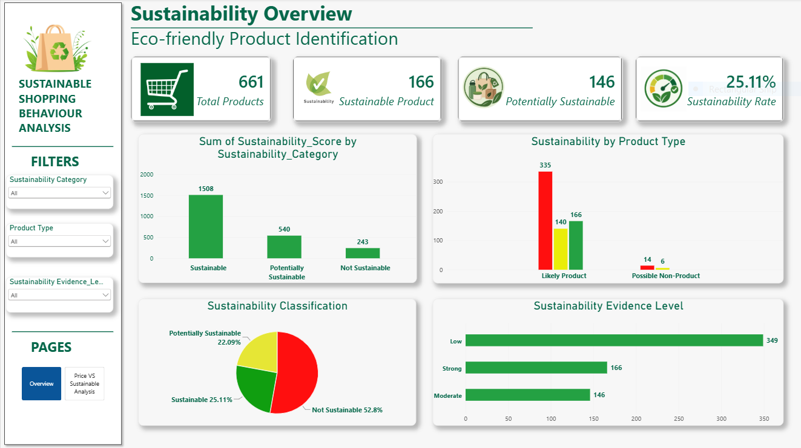
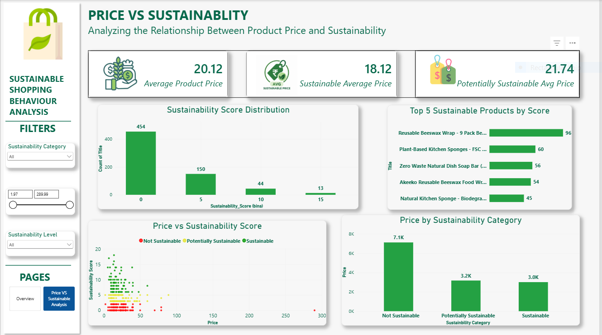

# 🌱 Sustainable Shopping Behaviour Analysis

## 📌 Project Overview

The **Sustainable Shopping Behaviour Analysis** project explores e-commerce product data to identify sustainable products and understand the relationship between **product price and sustainability**.

The project combines data cleaning, sustainability classification, statistical analysis, and interactive Power BI visualizations to generate meaningful insights into sustainable shopping behaviour.

This project was completed as part of my **Dynamix Networks Internship**.

---

## 🎯 Objectives

- Identify sustainable and potentially sustainable products
- Analyze sustainability patterns across products and categories
- Compare prices of products based on sustainability classification
- Explore the relationship between price and sustainability score
- Present insights through an interactive Power BI dashboard

---

## 🛠️ Tools & Technologies

- **Python**
- **Pandas**
- **Jupyter Notebook**
- **Microsoft Power BI**
- **Data Cleaning & Preprocessing**
- **Data Analysis**
- **Data Visualization**

---

## 📊 Dashboard

The Power BI dashboard consists of **two interactive pages**, each focusing on a different aspect of sustainable shopping behaviour.

### 📄 Page 1 — Sustainability Overview

This page provides an overall view of product sustainability.

It highlights key metrics and visualizations related to:

- Sustainable product identification
- Sustainability distribution
- Product categories
- Sustainability rates
- Overall product-level insights

The page helps users quickly understand the **overall sustainability profile of the analyzed products**.

---

### 📄 Page 2 — Price & Sustainability Analysis

This page focuses on the relationship between **product price and sustainability**.

It provides visual analysis of:

- Average product price
- Sustainability categories
- Sustainability scores
- Price comparison across sustainability categories
- Price vs. sustainability relationship

The analysis helps evaluate whether **higher-priced products are necessarily more sustainable**.

---

## 🔍 Key Findings

- **25.11%** of analyzed products were classified as Sustainable.
- **22.09%** were classified as Potentially Sustainable.
- **52.80%** were classified as Not Sustainable.
- Sustainable products had an average price of approximately **$18.12**.
- The correlation between price and sustainability score was approximately **-0.075**, indicating a very weak linear relationship.

These findings suggest that **product price alone does not necessarily indicate a higher level of sustainability**.

---

## 📈 Project Outcome

The project transforms raw e-commerce and sustainable-product data into an interactive analytical dashboard.

It demonstrates practical skills in **data preprocessing, analysis, sustainability classification, Power BI visualization, KPI development, and analytical storytelling**.

---

## ⚠️ Disclaimer

This project is intended for educational and analytical purposes. The sustainability classifications and insights are based on the available dataset and analysis methodology and should not be considered an official certification of product sustainability.

---

## 👩‍💻 Author

**Bhumika Maurya**

Data Analyst | Python | SQL | Power BI | Excel

---

## ⭐ Acknowledgement

This project was completed as part of my **Dynamix Networks Internship**.
